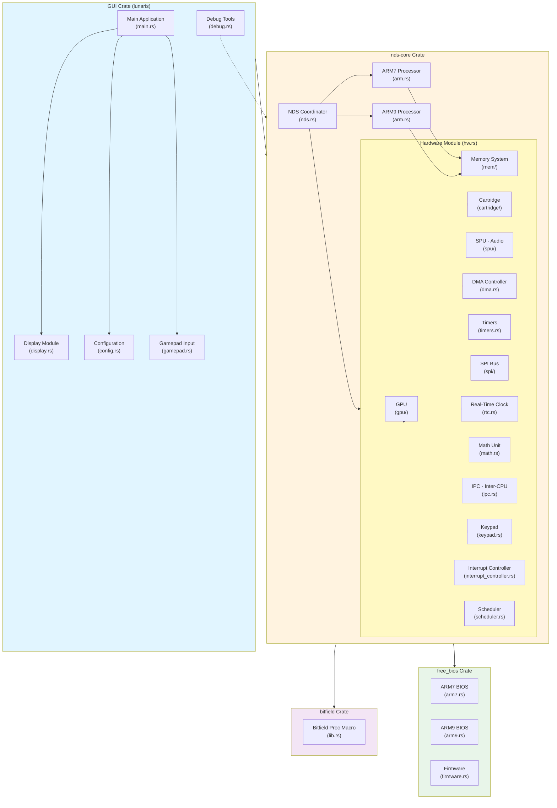

# Lunaris: A Modern Nintendo DS Emulator

**Lunaris** is a high-performance Nintendo DS emulator written in Rust. This document provides an architectural overview of the emulator, describing its modular crate-based structure, core components, and their interactions.

---

## Architecture Overview

The Lunaris emulator is organized into four main crates, each with specific responsibilities:

---

## Crate Descriptions

### 1. **bitfield** - Bitfield Macro Utility

**Location:** [bitfield/](bitfield/)

A procedural macro (proc-macro) crate that generates utilities for working with bitfield structures. This is essential for emulating hardware registers where individual bits or ranges of bits have specific meanings.

**Key Components:**
- [bitfield/src/lib.rs](bitfield/src/lib.rs) - Main macro implementation
  - Parses bitfield definitions with specified bit ranges
  - Generates getter and setter methods for each field
  - Validates range bounds and prevents overlaps
  - Supports bool and integer types

**Usage:** Used throughout `nds-core` to define and manipulate hardware registers efficiently.

---

### 2. **free_bios** - Firmware and BIOS Data

**Location:** [free_bios/](free_bios/)

A data crate containing the binary firmware and BIOS images required to boot the NDS.

**Key Components:**
- [free_bios/src/arm7.rs](free_bios/src/arm7.rs) - ARM7 BIOS binary (`BIOS_ARM7_BIN`)
- [free_bios/src/arm9.rs](free_bios/src/arm9.rs) - ARM9 BIOS binary (`BIOS_ARM9_BIN`)
- [free_bios/src/firmware.rs](free_bios/src/firmware.rs) - NDS firmware binary (`FIRMWARE_DS`)

**Functionality:**
- Provides bootcode and system firmware as embedded byte arrays
- Supports test utilities to extract binaries to filesystem

---

### 3. **nds-core** - Main Emulation Engine

**Location:** [core/](core/)

The heart of the emulator, containing the CPU emulation and all hardware component implementations.

#### 3.1 ARM Processor Emulation

**Path:** [core/src/arm/](core/src/arm/) and [core/src/arm.rs](core/src/arm.rs)

Implements the dual ARM processors of the NDS:

- **[core/src/arm.rs](core/src/arm.rs)** - ARM CPU struct and execution logic
  - Dual-processor configuration (ARM7 and ARM9)
  - Instruction pipeline and buffering
  - Cycle-accurate timing
  - Mode management (User, FIQ, IRQ, Supervisor, Abort, Undefined)

- **[core/src/arm/arm.rs](core/src/arm/arm.rs)** - ARM instruction set execution
  - 32-bit ARM instruction decoding and execution
  - Lookup table (LUT) based instruction dispatch for performance

- **[core/src/arm/thumb.rs](core/src/arm/thumb.rs)** - Thumb instruction set execution
  - 16-bit Thumb instruction decoding and execution
  - Compact instruction encoding

- **[core/src/arm/registers.rs](core/src/arm/registers.rs)** - CPU register management
  - General-purpose registers (R0-R15)
  - Program Counter (PC) and Stack Pointer (SP)
  - Mode-specific register banks

- **[core/src/arm/instructions.rs](core/src/arm/instructions.rs)** - Instruction definitions and handlers
  - ALU operations (AND, ORR, EOR, ADD, SUB, etc.)
  - Memory operations (LDR, STR, LDM, STM)
  - Branch operations
  - Condition code evaluation

#### 3.2 Hardware Emulation Module

**Path:** [core/src/hw/](core/src/hw/) and [core/src/hw.rs](core/src/hw.rs)

Comprehensive hardware emulation including processors, memory, graphics, audio, and peripherals:

**[core/src/hw.rs](core/src/hw.rs)** - Main hardware coordinator
- `HW` struct managing all hardware components
- Memory management and access control
- Device initialization and lifecycle

**Graphics & Display:**
- **[core/src/hw/gpu.rs](core/src/hw/gpu.rs)** - GPU engine implementation
  - Engine A (3D graphics)
  - Engine B (2D graphics)
  - Scanline rendering
  - Sprite and background handling
  - Frame synchronization
- **[core/src/hw/gpu/](core/src/hw/gpu/)** - GPU sub-modules

**Audio:**
- **[core/src/hw/spu.rs](core/src/hw/spu.rs)** - Sound Processing Unit
  - 16-channel audio synthesis
  - PCM and PSG synthesis
  - Volume and panning control

**Memory System:**
- **[core/src/hw/mem.rs](core/src/hw/mem.rs)** and **[core/src/hw/mem/](core/src/hw/mem/)** - Memory management
  - Virtual memory with page tables
  - BIOS, ITCM, DTCM, and shared WRAM management
  - Memory access types (N, S, I access)
  - CP15 coprocessor (system control)

**Cartridge & Storage:**
- **[core/src/hw/cartridge.rs](core/src/hw/cartridge.rs)** - ROM cartridge emulation
  - Game ROM loading and access
- **[core/src/hw/cartridge/](core/src/hw/cartridge/)** - Cartridge sub-components

**DMA & Transfers:**
- **[core/src/hw/dma.rs](core/src/hw/dma.rs)** - Direct Memory Access
  - Four DMA channels (0-3)
  - Timing and synchronization

**Timers & Scheduling:**
- **[core/src/hw/timers.rs](core/src/hw/timers.rs)** - 4 hardware timers per CPU
  - Cascading timer support
  - Interrupt generation
- **[core/src/hw/scheduler.rs](core/src/hw/scheduler.rs)** - Event scheduler
  - Cycle-accurate event scheduling
  - GPU scanline events
  - Timer events
  - Unified event queue

**Communication:**
- **[core/src/hw/ipc.rs](core/src/hw/ipc.rs)** - Inter-Processor Communication
  - Message passing between ARM7 and ARM9
  - Interrupt synchronization

**Peripherals:**
- **[core/src/hw/keypad.rs](core/src/hw/keypad.rs)** - Input handling
  - Button state tracking
  - Touch screen coordinates
- **[core/src/hw/spi.rs](core/src/hw/spi.rs)** and **[core/src/hw/spi/](core/src/hw/spi/)** - Serial Peripheral Interface
  - Communications with external chips
  - Power management IC (PMIC)
- **[core/src/hw/rtc.rs](core/src/hw/rtc.rs)** - Real-Time Clock
  - Date and time tracking
- **[core/src/hw/math.rs](core/src/hw/math.rs)** - Math accelerator
  - Division unit (DIV)
  - Square root unit (SQRT)
- **[core/src/hw/interrupt_controller.rs](core/src/hw/interrupt_controller.rs)** - Interrupt management
  - Interrupt request/acknowledge
  - Interrupt masking and priorities

#### 3.3 Main NDS Coordinator

**[core/src/nds.rs](core/src/nds.rs)** - NDS system orchestration
- `NDS` struct coordinating ARM7, ARM9, and hardware
- Frame emulation loop
- Cycle-accurate execution
- Frame synchronization with GPU

---

### 4. **lunaris (gui)** - GUI Frontend Application

**Location:** [gui/](gui/)

The user-facing application providing ROM loading, display, and debugging capabilities.

**Key Components:**
- **[gui/src/main.rs](gui/src/main.rs)** - Application entry point
  - ROM loading (file dialog or command-line)
  - Logging setup
  - Main emulation loop

- **[gui/src/display.rs](gui/src/display.rs)** - Graphics rendering
  - OpenGL rendering pipeline
  - GLFW window management
  - Screen composition (two NDS screens)

- **[gui/src/gamepad.rs](gui/src/gamepad.rs)** - Input handling
  - Keyboard to NDS button mapping
  - Touch input support

- **[gui/src/debug.rs](gui/src/debug.rs)** and **[gui/src/debug/](gui/src/debug/)** - Debugging tools
  - CPU state inspection
  - Memory viewer
  - Breakpoint support

- **[gui/src/config.rs](gui/src/config.rs)** - Configuration management
  - Persistent settings
  - Last ROM path
  - Graphics and input preferences

**Dependencies:**
- `imgui` - Immediate-mode GUI framework
- `gl` - OpenGL bindings
- `glfw` - Window and input management
- `nds-core` - Emulation engine

---

## Execution Flow

### Frame Emulation Cycle

1. **GUI Layer** ([gui/src/main.rs](gui/src/main.rs))
   - Polls input devices
   - Renders current frame to screen
   - Handles user interactions

2. **NDS Coordinator** ([core/src/nds.rs](core/src/nds.rs))
   - Calls `emulate_frame()` to execute one NDS frame (~60fps)
   - Synchronizes ARM7 and ARM9 execution

3. **CPU Execution** ([core/src/arm.rs](core/src/arm.rs))
   - ARM9 runs at 2x the cycle rate of ARM7
   - Both processors execute until cycle budget exhausted
   - Instructions dispatched via LUT-based handlers

4. **Hardware Processing** ([core/src/hw/](core/src/hw/))
   - GPU renders scanlines
   - Audio samples generated by SPU
   - Timers and schedulers track events
   - Interrupt controller processes requests

5. **Memory Access** ([core/src/hw/mem.rs](core/src/hw/mem.rs))
   - CPU instructions access memory through HW interface
   - Page tables translate virtual to physical addresses
   - Access timing (N, S, I) affects cycle counting

---

## Key Technologies & Dependencies

| Component         | Technology                    | Purpose                     |
| ----------------- | ----------------------------- | --------------------------- |
| Procedural Macros | `proc-macro2`, `quote`, `syn` | Bitfield code generation    |
| Audio             | `cpal`                        | Cross-platform audio output |
| Graphics          | `gl`, `glfw`, `imgui`         | Rendering and UI            |
| Data Processing   | `bytemuck`                    | Safe byte casting           |
| Scheduling        | `priority-queue`, `ringbuf`   | Event management            |
| Binary Data       | Embedded byte arrays          | BIOS/Firmware storage       |

---

## Performance Optimizations

1. **Lookup Tables (LUT)**
   - Instruction handlers pre-computed via LUT for O(1) dispatch
   - Condition code evaluation cached in table

2. **Likely/Unlikely Hints**
   - CPU branch hints for branch prediction optimization
   - Nightly feature for `core::intrinsics::{likely, unlikely}`

3. **Cycle-Accurate Timing**
   - Dual-CPU desynchronization managed to ±30 cycles
   - Event scheduler triggers on precise cycle counts

4. **Memory Page Tables**
   - Direct pointer arrays for O(1) memory access
   - Virtual-to-physical mapping cached

---

## Extensibility Points

- **New Hardware Components:** Add modules in [core/src/hw/](core/src/hw/) following the `HW` struct pattern
- **Instruction Support:** Extend ARM/Thumb instruction handlers in [core/src/arm/](core/src/arm/)
- **Debug Tooling:** Add inspection windows in [gui/src/debug/](gui/src/debug/)
- **Input Mapping:** Configure key bindings in [gui/src/gamepad.rs](gui/src/gamepad.rs)

---

## References

- NDS Hardware Documentation
- ARM7/ARM9 ISA Reference
- Rust Procedural Macros Guide
- Lunaris Repository: https://github.com/Thoughts-with-friends/lunaris
